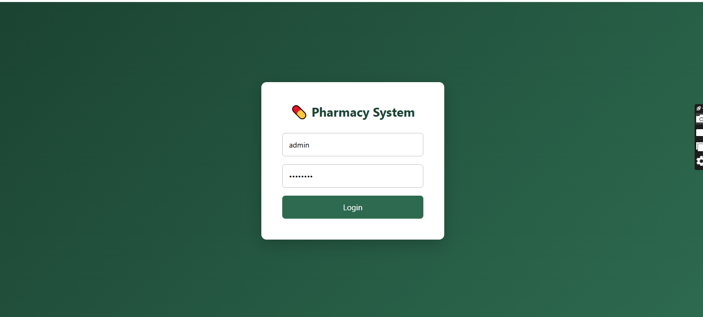
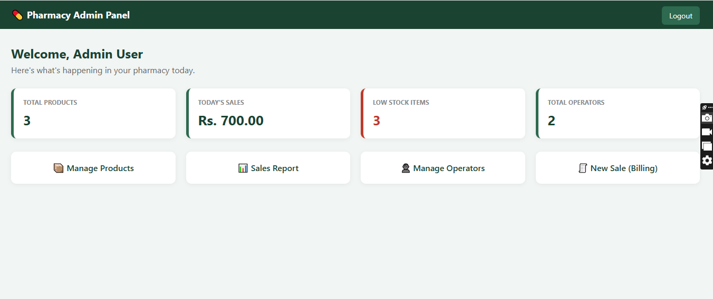
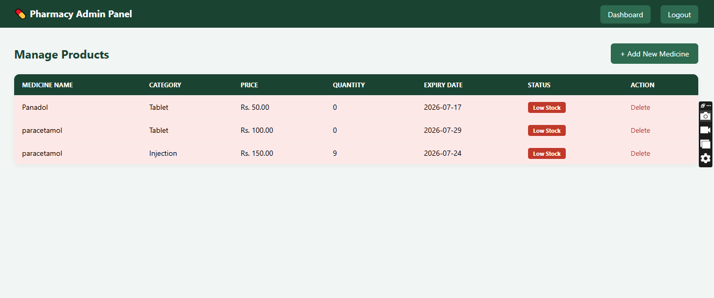
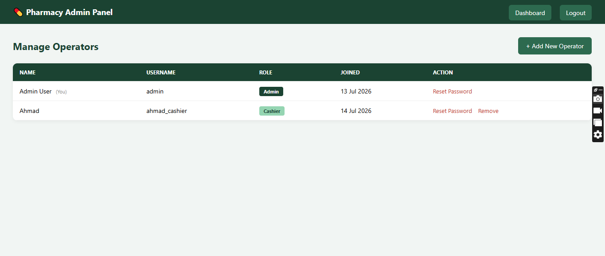
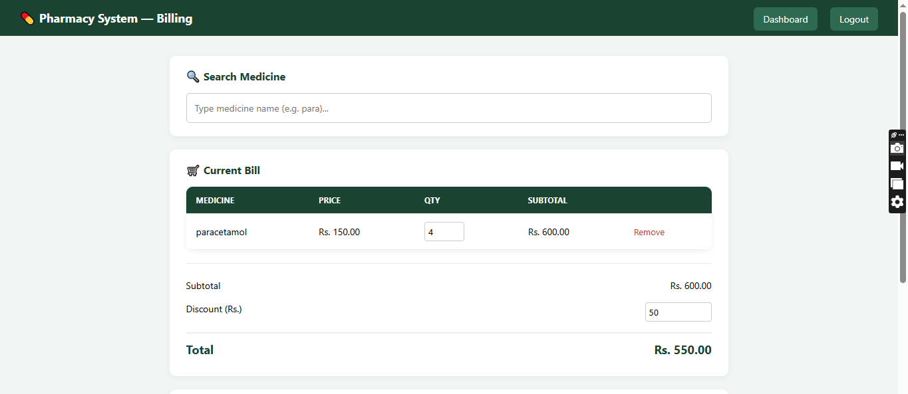
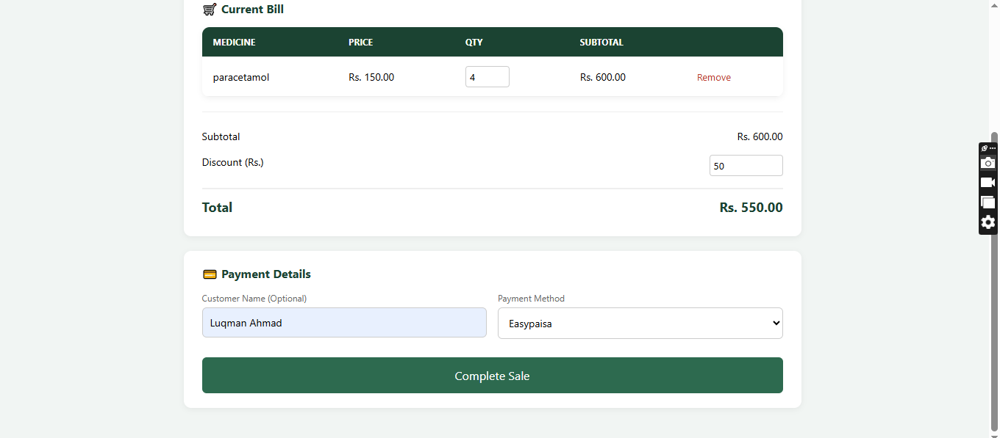
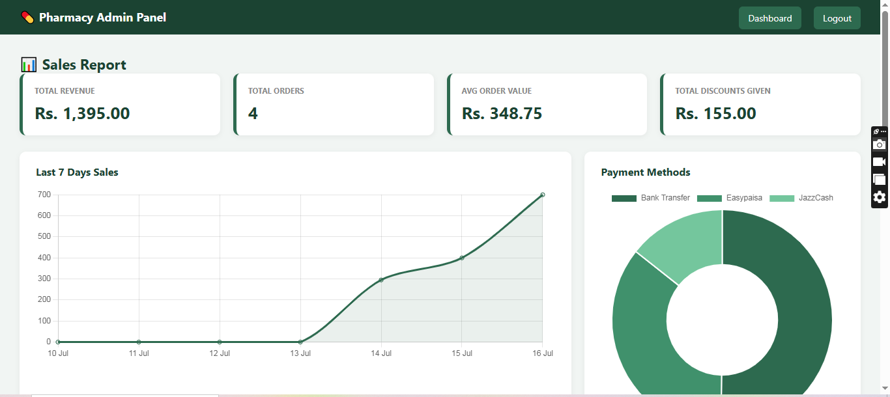
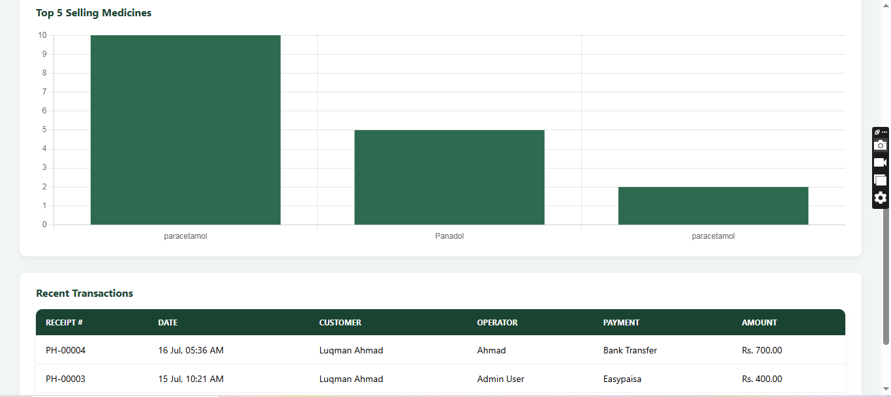
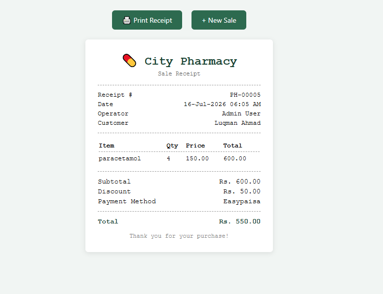

# 💊 Pharmacy Management System

A full-stack Pharmacy Management System built with **PHP & MySQL** — featuring role-based login, live medicine search billing, stock & expiry tracking, and a sales analytics dashboard.

Built as a self-initiated project to practice real-world system design: database transactions, stock safety checks, and secure authentication.

---

## 👨‍💻 Developer

**Luqman Ahmad** — [GitHub](https://github.com/luqman-ahmad-cs)

---

## ✨ Features

### For Cashiers
- Secure login (role-based access)
- **Live autocomplete medicine search** while billing — type a few letters, matching medicines appear instantly
- Multi-item cart with real-time subtotal/total calculation
- Discount and multiple payment methods (Cash, Bank Transfer, Easypaisa, JazzCash)
- Automatic stock deduction on sale, with stock-level validation (can't oversell)
- Printable, professional sales receipt

### For Admins
- Everything Cashiers can do, plus:
- Full product management — add medicines with price, quantity, category, and expiry date
- Automatic **low stock** and **expired medicine** alerts on the products list
- Sales analytics dashboard (Chart.js) — daily sales trend, payment method breakdown, top-selling medicines
- Operator management — add Cashiers/Admins, reset passwords, with safeguards against deleting operators with sales history or removing the last remaining Admin

---

## 🎥 Demo

*(Add a demo video link here once recorded)*

---

## 🖼️ Screenshots

### Login


### Admin Dashboard


### Manage Products


### Manage Operators


### Billing — Live Medicine Search



### Sales Report & Analytics



### Printable Receipt


---

## 🛠️ Tech Stack

| Layer | Technology |
|---|---|
| Backend | PHP |
| Database | MySQL |
| Frontend | HTML, CSS, JavaScript |
| Charts/Analytics | Chart.js |
| Search | AJAX (Fetch API) for live medicine autocomplete |
| Authentication | PHP Sessions + `password_hash()` / `password_verify()` |
| Local Server | XAMPP (Apache + MySQL) |

---

## 🗄️ Database Structure

The system uses a MySQL database (`pharmacy_db`) with four core tables:

- `operators` — login credentials and roles (Admin / Cashier)
- `products` — medicine details: name, category, price, quantity, expiry date, low-stock threshold
- `sales` — one record per bill: total, discount, payment method, operator, customer name
- `sale_items` — line items within each sale, linked to `sales` and `products`

Foreign key constraints protect data integrity — for example, an operator with existing sales records cannot be deleted, preserving accurate sales history.

---

## ⚙️ Installation & Setup

1. **Clone the repository**
   ```bash
   git clone https://github.com/luqman-ahmad-cs/pharmacy-management-system.git
   ```

2. **Move the project into your XAMPP htdocs folder**
   ```
   C:\xampp\htdocs\pharmacy_system
   ```

3. **Start XAMPP** — enable Apache and MySQL

4. **Import the database**
   - Open phpMyAdmin (`localhost/phpmyadmin`)
   - Create a database named `pharmacy_db`
   - Run the SQL schema (see `db/` folder or the table structure above) to create the four tables

5. **Configure your environment**
   - Open `db/connection.php`
   - Set your database host, username, and password if different from defaults

6. **Run the project**
   ```
   http://localhost/pharmacy_system
   ```
   - Default login — Username: `admin`, Password: `admin123` *(change this after first login)*

---

## 📌 Key Technical Highlights

- **Live AJAX search** — medicine search-as-you-type without page reloads, built with vanilla JavaScript Fetch API
- **Transaction-safe billing** — sale creation, stock deduction, and line-item insertion are wrapped in a database transaction; if any step fails, the entire sale rolls back to prevent partial/corrupted records
- **Stock validation with row locking** (`FOR UPDATE`) — prevents overselling when checking out
- **Secure authentication** — passwords hashed with PHP's `password_hash()`, never stored in plain text
- **Role-based access control** — Admin-only pages are protected at the session level
- **Data integrity safeguards** — prevents deleting operators tied to sales history or removing the last Admin account
- **Shared stylesheet architecture** — all pages pull from a single `assets/css/style.css` for consistent, maintainable design

---

## 📄 License

This project was built as a personal portfolio project to demonstrate full-stack development skills.

---

## 📬 Contact

**Luqman Ahmad**
📧 luqman.ahmad.cs@gmail.com
🔗 [GitHub](https://github.com/luqman-ahmad-cs)
